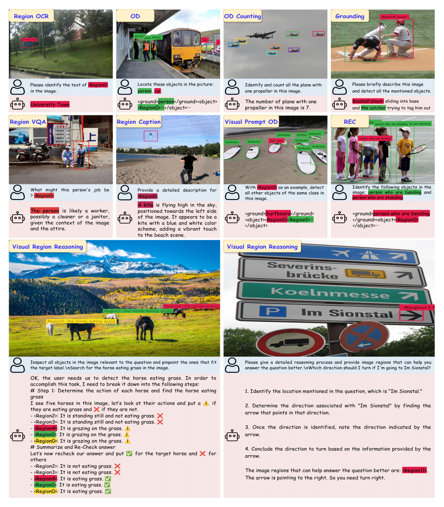
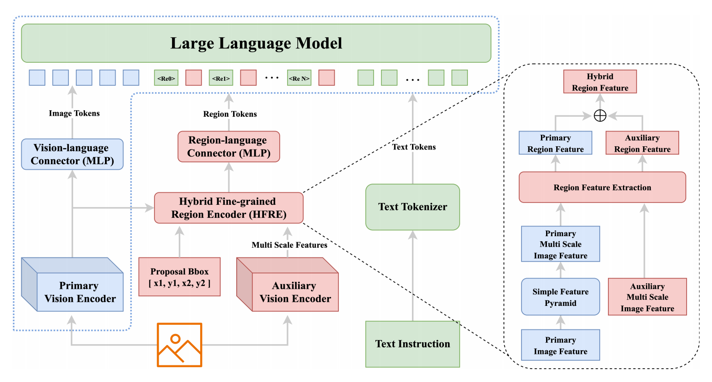

<<<<<<< HEAD
# VLM-FO1: Bridging the Gap Between High-Level Reasoning and Fine-Grained Perception

<p align="center">
 <a href="https://arxiv.org/pdf/2509.25916"><strong> [Paper 📄] </strong></a> <a href="https://huggingface.co/omlab/VLM-FO1_Qwen2.5-VL-3B-v01"><strong> [Model 🗂️] </strong></a>
</p>

<p align="left">
VLM-FO1 endows pre-trained VLMs with superior fine-grained perception without compromising their inherent high-level reasoning and general understanding capabilities. It operates as a plug-and-play module that can be integrated with any existing VLM, establishing an effective and flexible paradigm for building the next generation of perception-aware models.
</p>

VLM-FO1 excels at a wide range of fine-grained perception tasks, including Object Grounding, Region Generative
Understanding, Visual Region Reasoning, and more.

For more details, check out our **[paper](https://arxiv.org/abs/2403.06892)**

<p align="center">
  
</p>

## ✨ Key Features

🧩 **Plug-and-Play Modularity:** Our framework is designed as a set of enhancement modules that can be seamlessly integrated with any pre-trained VLM, preserving its original weights and capabilities.

🧠 **Hybrid Region Encoder (HFRE):** We introduce a novel Dual-Vision Encoder architecture that fuses semantic-rich features with perception-enhanced features, creating powerful region tokens that capture both high-level meaning and fine-grained spatial detail.

🎯 **State-of-the-Art Performance:** VLM-FO1 achieves SOTA results across a diverse suite of benchmarks.

✅ **Preserves General Abilities:** Our two-stage training strategy ensures that fine-grained perception is gained without causing catastrophic forgetting of the base model's powerful general visual understanding abilities.

<p align="center">
  
</p>


## 📋 Table of Contents

- [Installation](#installation)
- [Quick Start](#quick-start)
  - [Inference with Provided Bounding Boxes](#2-inference-with-provided-bounding-boxes)
  - [Inference with UPN Detector](#3-inference-with-upn-detector)
- [Task Templates](#task-templates)
- [Evaluation](#evaluation)
- [Citation](#citation)
- [Acknowledgements](#acknowledgements)

## 🛠️ Installation

### Requirements

- Python 3.10+
- PyTorch (GPU recommended). Please install the CUDA-enabled build that matches your system.
- Linux is the primary tested platform.

### Setup

```bash
git clone [repo link placeholder]
cd VLM-FO1
pip install -r requirements.txt
```

If you use conda:

```bash
conda create -n vlmfo1 python=3.10 -y
conda activate vlmfo1
pip install -r requirements.txt
```

## 🚀 Quick Start

### 1) Download Model Checkpoints

Download the pre-trained VLM-FO1 checkpoints from Hugging Face and place them under `resources/`:

- Pre-trained model: [Hugging Face link](https://huggingface.co/omlab/VLM-FO1_Qwen2.5-VL-3B-v01)
- Suggested local path: `resources/VLM-FO1_Qwen2.5-VL-3B-v01/`

### 2) Inference with Provided Bounding Boxes

Use `inference.py` to run VLM-FO1 with provided bounding boxes. 

Run:

```bash
python inference.py
```

The visualization with predicted boxes will be saved to `demo/vlm_fo1_result.jpg`.

### 3) Inference with UPN Detector

**Note:** Due to company policy, we are unable to release the object detector OPN referenced in our paper. Instead, we provide integration with UPN (from [ChatRex](https://github.com/IDEA-Research/ChatRex)), which offers similar functionality. You are also free to use any object detector of your choice by preparing bounding box proposals compatible with our pipeline.

Before running, you need to install UPN's requirements and build the ops extension:

```bash
cd detect_tools/upn
pip install -r requirements.txt
cd ops
pip install -v -e .
```

Then, download the UPN checkpoint from [this link](https://github.com/IDEA-Research/ChatRex/releases/download/upn-large/upn_large.pth) and place it in your `resources/` folder:

```
wget https://github.com/IDEA-Research/ChatRex/releases/download/upn-large/upn_large.pth -P resources/
```

Use `scripts/inference_with_upn.py` to run FO1 with UPN-generated proposals.

Run:

```bash
python scripts/inference_with_upn.py
```

The script will:

- Load UPN and produce fine-grained object proposals
- Filter proposals by score
- Pass top proposals to FO1 for reasoning
- Save the visualization to `demo/vlm_fo1_result.jpg`

## 📝 Task Templates

We provide task templates to facilitate tasks beyond detection (e.g., counting, grounding, and other vision-language reasoning tasks). See `vlm_fo1/task_templates` for examples. You can adapt the prompts or message construction to your specific application.

## Evaluation
**Model performance when integrated with UPN is as follows:**
| Model                          | COCO mAP | CountBench Accuracy | Pixmo-Count Accuracy |
|---------------------------------|----------|---------------------|----------------------|
| VLM-FO1_Qwen2.5-VL-3B-v01 (FO1 + UPN) |   44.6   |       89.94%        |       84.88%         |

For benchmarking FO1 with UPN on your datasets, you can adapt the inference pipeline to export predictions and compare against ground-truth. We also include evaluation utilities under `evaluation/` for specific tasks.

- CountBench/Pixmo-Count evaluation: `evaluation/eval_countbench.py`
- COCO evaluation: `evaluation/eval_coco.py` (this script will output a prediction json file which you can use with the standard COCO evaluation tool to obtain scores)

## 📄 Citation

If you find VLM-FO1 useful in your research or applications, please cite our work:

```bibtex
@article{liu2025vlm,
  title={VLM-FO1: Bridging the Gap Between High-Level Reasoning and Fine-Grained Perception in VLMs},
  author={Liu, Peng and Shen, Haozhan and Fang, Chunxin and Sun, Zhicheng and Liao, Jiajia and Zhao, Tiancheng},
  journal={arXiv preprint arXiv:2509.25916},
  year={2025}
}
```

## 🙏 Acknowledgements
- Thanks to the Qwen Team for their powerful [Qwen2.5-VL](https://github.com/QwenLM/Qwen3-VL) model.
- UPN detector is integrated from an external open-source project. Please refer to: [ChatRex](https://github.com/IDEA-Research/ChatRex)
- Dataset images used above are from public benchmarks ([Pixmo-Count](https://huggingface.co/datasets/allenai/pixmo-count), [CountBenchQA](https://huggingface.co/datasets/vikhyatk/CountBenchQA)), credited to their respective authors.
- Thanks to the numerous researchers and developers who have contributed to the datasets used in our training.

=======
# VLM-FO1
## Open Source Code and Model Coming Soon !!!
>>>>>>> 720ae38319af2f024238fb7c6985cd67ef3f8d89
